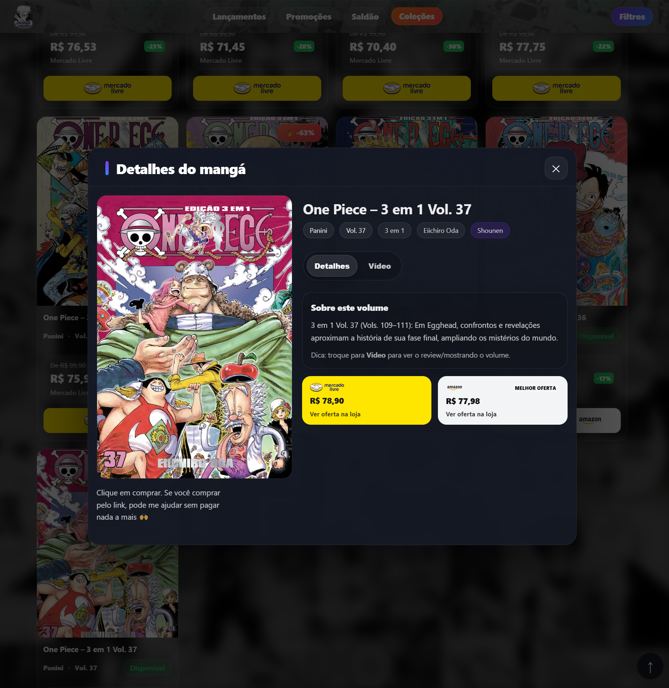

# Mangá Drops

Mangá Drops é um agregador de ofertas de mangás que reúne produtos, coleções e preços atualizados de lojas como **Amazon** e **Mercado Livre**.

O projeto organiza volumes e séries em uma interface moderna inspirada em plataformas de streaming, facilitando a descoberta de mangás com bons preços.

---

## Home


## Página de série


## Modal do Produto


---

# Tecnologias

Frontend

- React
- Vite
- JavaScript

Automação

- Node.js
- Puppeteer (scraping de preços)

Infraestrutura

- GitHub Actions
- GitHub Pages

---

# Funcionalidades

O projeto inclui diversas funcionalidades voltadas para organização e descoberta de mangás.

### Catálogo organizado

- séries completas
- volumes individuais
- descrições editoriais

### Sistema de preços

- scraping automático
- melhor preço entre lojas
- badges de desconto

### Interface moderna

- rails horizontais inspirados em streaming
- modal de produto
- navegação por coleção

### Automação

- atualização automática de preços
- deploy automatizado

---

# Arquitetura do projeto

O projeto é dividido em três camadas principais.

```
data → estrutura de produtos e séries
scripts → automação e scraping
components → interface React
```

Fluxo completo:

```
Gerador de obras
      ↓
Catálogo de produtos
      ↓
Links afiliados
      ↓
Scraping de preços
      ↓
Frontend React
      ↓
Deploy
```

---

# Estrutura do projeto

```
.github/
scripts/
public/
src/
```

Detalhamento:

```
.github        → workflows de automação
scripts        → scraping e deploy
public         → arquivos estáticos
src            → frontend do site
```

Dentro de `src`:

```
components     → interface do site
data           → produtos, séries e preços
hooks          → lógica reutilizável
pages          → páginas do site
styles         → estilos
utils          → funções auxiliares
```

Cada pasta possui seu próprio `README` explicando sua responsabilidade.

---

# Como rodar o projeto

Instalar dependências:

```
npm install
```

Rodar o projeto localmente:

```
npm run dev
```

O site estará disponível em:

```
http://localhost:5173
```

---

# Atualizar preços

Para atualizar os preços dos produtos:

```
npm run update-prices
```

Esse script:

1. lê os produtos cadastrados
2. acessa os links afiliados
3. extrai os preços
4. salva em:

```
src/data/prices.json
```

---

# Deploy

Para publicar o site:

```
npm run publish
```

Esse comando executa:

```
build
↓
preparação do deploy
↓
publicação no GitHub Pages
```

---

# Adicionando novas séries

Novas séries são adicionadas através do gerador administrativo:

```
gerador-obras-admin-writer-v3.html
```

Esse gerador cria automaticamente:

- catálogo de séries
- descrições
- conteúdo para redes sociais
- links afiliados

Isso garante padronização e reduz erros.

---

# Roadmap

Possíveis melhorias futuras:

- histórico de preços
- mais lojas além de Amazon e Mercado Livre
- filtros avançados
- busca inteligente
- sistema de recomendação de mangás

---

# Licença

Projeto desenvolvido para estudo e uso pessoal.